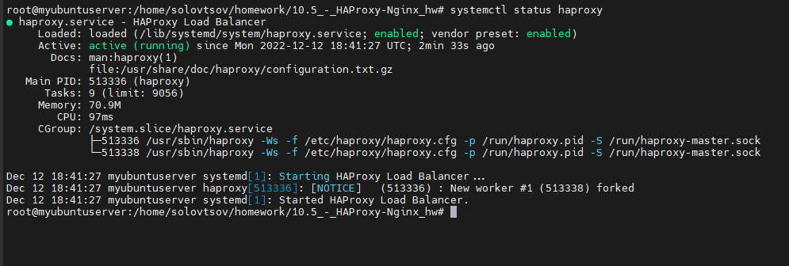
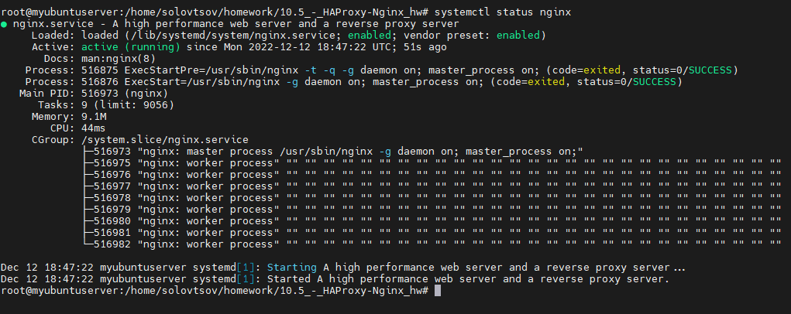
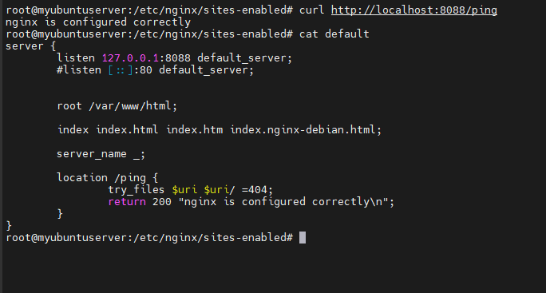

# Домашнее задание к занятию "10.5 Балансировка нагрузки. HAProxy/Nginx." - Соловцов Николай

### Инструкция по выполнению домашнего задания

   1. Сделайте `fork` данного репозитория к себе в Github и переименуйте его по названию или номеру занятия, например, https://github.com/имя-вашего-репозитория/git-hw или  https://github.com/имя-вашего-репозитория/7-1-ansible-hw).
   2. Выполните клонирование данного репозитория к себе на ПК с помощью команды `git clone`.
   3. Выполните домашнее задание и заполните у себя локально этот файл README.md:
      - впишите вверху название занятия и вашу фамилию и имя
      - в каждом задании добавьте решение в требуемом виде (текст/код/скриншоты/ссылка)
      - для корректного добавления скриншотов воспользуйтесь [инструкцией "Как вставить скриншот в шаблон с решением](https://github.com/netology-code/sys-pattern-homework/blob/main/screen-instruction.md)
      - при оформлении используйте возможности языка разметки md (коротко об этом можно посмотреть в [инструкции  по MarkDown](https://github.com/netology-code/sys-pattern-homework/blob/main/md-instruction.md))
   4. После завершения работы над домашним заданием сделайте коммит (`git commit -m "comment"`) и отправьте его на Github (`git push origin`);
   5. Для проверки домашнего задания преподавателем в личном кабинете прикрепите и отправьте ссылку на решение в виде md-файла в вашем Github.
   6. Любые вопросы по выполнению заданий спрашивайте в чате учебной группы и/или в разделе “Вопросы по заданию” в личном кабинете.
   
Желаем успехов в выполнении домашнего задания!
   
### Дополнительные материалы, которые могут быть полезны для выполнения задания

1. [Руководство по оформлению Markdown файлов](https://gist.github.com/Jekins/2bf2d0638163f1294637#Code)

---

### Задание 1

Что такое балансировка нагрузки и зачем она нужна?

**Ответ:**

Это процесс распределения нагрузки между серверами. Нужна для увеличения отказоустойчивости и сокращении времени простоя сероверов. 

### Задание 2

Чем отличаются между собой алгоритмы балансировки round robin и weighted round robin? В каких случаях каждый из них лучше применять?

**Ответ:**

При использовании Round Robin запросы распределяются последовательно, подходит при использовании серверов схожей мощности. Weighted round robin отличается тем, что есть возможность указать
сколько трафика отправлять  на сервер, подходит для использовния с серверами различной мощности.

### Задание 3

Установите и запустите haproxy

**Ответ:**

### Задание 4

Установите и запустите nginx.

**Ответ:**

### Задание 5

Настройте nginx на виртуальной машине таким образом, чтобы при запросе:

curl http://localhost:8088/ping

он возвращал в ответе строчку:

"nginx is configured correctly"

**Ответ:**

